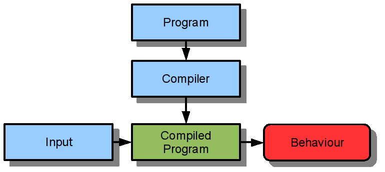
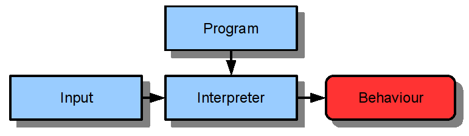
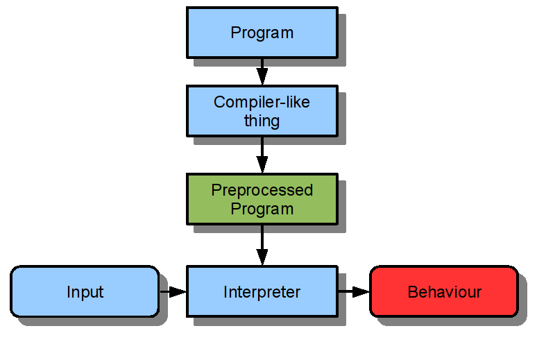
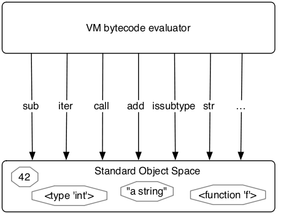

.. include:: <s5defs.txt>

==============================
Implementing dynamic languages
==============================

Overview
========

* Pure compilation
* Pure interpretation

Pure compiler
=============

Example: C, Pascal, ...

Pure interpreter
================

Example: some BASIC...

Hybrid approaches
=================

It's a complete continuum.  In practice:

* Interpretation typically analyze the source a bit
* Emulators interpret "compiled" code
* CPUs interpret compiled code anyway... or compile it
* JIT compilers

Dynamic languages
=================

Dynamic languages cannot be fully compiled.

.. sourcecode:: python

    def sum(container, initial):
        result = initial
        for element in container:
            result = result + element
        return result

JIT compilers
=============

Best approach for dynamic languages: we spend a lot of time in a small
part of the code.

* for most of the code, interpreting is fine;
* for the rest, we compile a Just-In-Time version.

Quiz
====

.. sourcecode:: python

Interpreters in practice
========================

.. We will focus now on interpreters.

AST Interpreters
================

AST = Abstract Syntax Tree

Avoids continuous reanalysis of the source code.

See exercices :-)

AST Interpreters (2)
====================

Upsides:

* avoids continuous reanalysis of the source code.
* simple to implement.

Downsides:

* complex data structure.
* lots of virtual calls to implement it.

Bytecode Interpreters
=====================

Turns the AST into "machine code" for a fictional
processor.

Executes on top of a Virtual Machine, which plays
the role of "emulator".

"Machine code" here can be much higher level than real
machine code.

Bytecode Interpreters (2)
=========================

Upsides:

* relatively fast to interpret.
* compact data structure (can be dumped to disk, etc.)

Downsides:

* a bit harder to implement.
* you need something compiler-like too.

Tiny example
============

.. sourcecode:: python

    def plus_minus(insns, x, y):
        acc = x
        pc = 0        # program counter
        while pc < len(insns):
            op = insns[pc]
            pc += 1
            if op == '+':
                acc += y
            elif op == '-':
                acc -= y
        return acc

Typical concepts
================

* Bytecodes
* Frames

In the frames:

* Program counter (pc)
* Stack
* Local variables

Python example (1)
==================

.. sourcecode:: python

    def f(x):
        return x + 5

Python example (2)
==================

.. sourcecode:: python

    def f(x):
        while x > 0:
            x = x - 10
        return x

Python bytecodes
================

* Operators: ``BINARY_ADD``, ``UNARY_NEGATIVE``, ``LOAD_ATTR``...

* Stack handling: ``POP_TOP``...

* Variables: ``LOAD_FAST``, ``STORE_FAST``...

* Control flow: ``JUMP_ABSOLUTE``, ``JUMP_IF_FALSE``...

SLF bytecodes
=============

...

Object Models
=============

When, What and How?
===================

- The bytecode dispatcher is concerned with:

  - which operations to perform
  - in what order

- but how are operations performed?

The Object Model
================

- to actually perform operations, the *object model* is asked to do them

- clean separation of concerns:

   - control flow
   - operation implementations

- object model maps objects of the language to the implementation level

Levels
=======

two languages involved in an interpreter:

- implemented language
- language the interpreter is written in

care is needed to not confuse those.

Terminology:

- application-level
- interpreter-level

Boxing
======================

- Object Model strongly dependant on those two involved languages

- Very common element: *Boxing*

- boxing uses a small data structure to represent an app-level type

- commonly used for numerical types: ints, floats, bools, ...

Example: exercises
===================

- object model: small hierarchy of classes

- boxing: ``W_Integer``

How to be more efficient
========================

- object models for prototypes need to be clever

- normally no sharing between similar objects

- can be circumvented by *maps*

- try to share bits of objects that have the same attributes

Example: PyPy
==============

- Python implementation in Python (!)

- tries to be understandable

PyPy Architecture
==================

clean separation between object model (called "object space") and bytecode interpreter:

